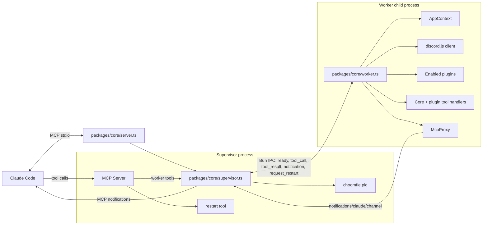
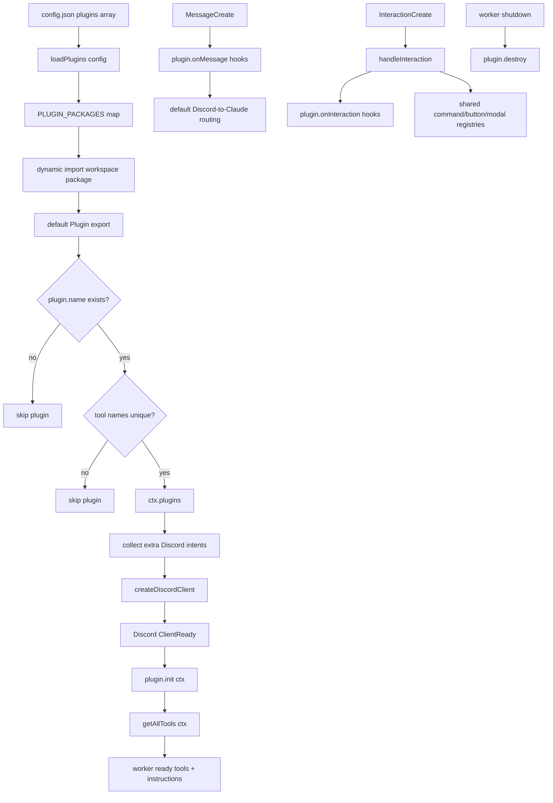
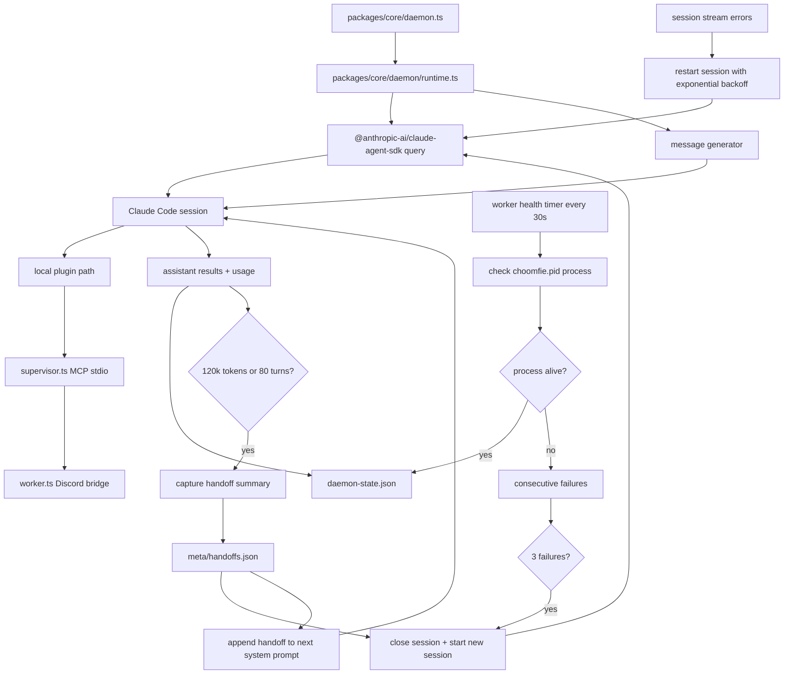

# Choomfie Architecture

This page summarizes the current runtime architecture. For deeper notes, see
`docs/supervisor-architecture.md`, `docs/architecture-v2.md`, and
`docs/voice-plugin.md`.

## Supervisor / Worker

The supervisor is the long-lived MCP process Claude Code talks to over stdio.
The worker is disposable and owns Discord, plugins, context, and tool handlers.

Startup sequence:

1. Claude Code launches `bun packages/core/server.ts`.
2. `server.ts` imports `supervisor.ts`.
3. The supervisor acquires `choomfie.pid`, spawns `worker.ts` with `Bun.spawn({ ipc })`, and waits for worker readiness.
4. The worker creates `AppContext`, loads enabled plugins, creates the Discord client, builds tool definitions and instructions, then sends `ready`.
5. The supervisor creates the MCP server with current tools and instructions and connects stdio transport.

Restart sequence:

1. Claude calls `restart`, or worker sends `request_restart` after persona/plugin/voice config changes.
2. The supervisor sends `shutdown` to the current worker and waits up to 5 seconds.
3. The supervisor spawns a fresh worker, waits for `ready`, and emits `notifications/tools/list_changed`.
4. The MCP stdio connection stays alive throughout the worker restart.

## Plugin Lifecycle

Plugins are workspace packages under `plugins/`. The loader resolves enabled
plugin names through an explicit package map in `packages/core/lib/plugins.ts`.

Lifecycle details:

- `tools` are appended to the MCP tool list after core tools.
- `instructions` are appended to the MCP system prompt.
- `intents` are merged into the Discord gateway intent list before login.
- `init(ctx)` runs after Discord is ready, reminder schedulers start, and owner fallback detection completes.
- `onMessage` hooks run before the default message forwarding logic.
- `onInteraction` hooks run before command, button, and modal dispatch.
- `destroy()` runs during worker shutdown before Discord and SQLite close.

## Daemon Mode

Daemon mode launches Claude Code sessions through the Agent SDK and keeps the
system running across context cycles.

Daemon state files:

- `meta/meta.pid` tracks the daemon process.
- `choomfie.pid` tracks the supervisor process used by worker health checks.
- `meta/handoffs.json` stores recent handoff summaries.
- `meta/daemon-state.json` records turns, tokens, cycles, provider, and worker health for status reporting.

Provider note: daemon sessions start on Anthropic. Repeated Anthropic API failures switch subsequent session starts to the Ollama-compatible fallback provider.

## Voice Pipeline

The voice plugin turns Discord voice activity into Claude channel notifications
and speaks Claude responses back through Discord voice.

```mermaid
flowchart LR
  User[User audio] --> DiscordOpus[Discord Opus packets]
  DiscordOpus --> Receiver[VoiceConnection receiver]
  Receiver --> SpeakerPipeline[per-speaker pipeline]
  SpeakerPipeline --> OpusDecode["@discordjs/opus decode"]
  OpusDecode --> VadInput[downsample for VAD]
  VadInput --> Silero[SileroVAD + SpeechDetector]

  Silero --> SpeechStart[speech_start]
  SpeechStart --> Collect[collect Opus chunks]
  Collect --> SegmentFlush{150 chunks?}
  SegmentFlush -- yes --> ParallelSTT[transcribe segment in parallel]
  Collect --> SpeechEnd[speech_end]
  SpeechEnd --> FinalFlush[flush final segment]
  FinalFlush --> Ffmpeg[ffmpeg 48kHz stereo PCM to 16kHz mono WAV]
  Ffmpeg --> STT[STT provider]
  STT --> Combine[combine transcripts]
  Combine --> Notification[MCP channel notification]
  Notification --> Claude[Claude Code]

  Claude --> SpeakTool[speak tool]
  SpeakTool --> Queue[speak queue + generation id]
  Queue --> Split[split into sentences]
  Split --> TTS[TTS provider]
  TTS --> Pipelined[pipeline next sentence while current plays]
  Pipelined --> AudioPlayer[Discord AudioPlayer]
  AudioPlayer --> VoiceChannel[Discord voice channel]

  Silero --> BargeIn{bot speaking + 300ms user speech?}
  BargeIn -- yes --> Interrupt[stop playback + invalidate generation]
  Interrupt --> Notification
  SpeechEnd --> Filler[optional persona filler audio]
  Filler --> AudioPlayer
```

Voice implementation notes:

- `plugins/voice/manager.ts` owns voice connections, provider selection, speak queues, and lifecycle cleanup.
- `plugins/voice/listening.ts` owns per-speaker receive pipelines, VAD, barge-in detection, chunk flushing, and transcript notification.
- `plugins/voice/transcription.ts` decodes Opus, runs ffmpeg resampling, calls STT, and emits MCP notifications.
- `plugins/voice/playback.ts` splits long speech into sentence chunks and pipelines TTS playback through `AudioPlayer`.
